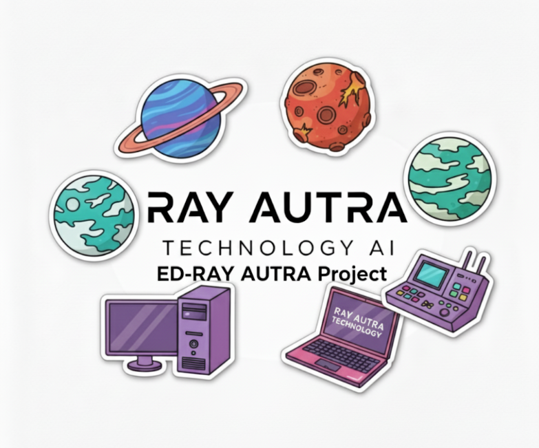

# ED-RAY-AUTRA-PROJECT
This repository contains MY NASA SPACE APP CHALLENGE project

[Project video](https://youtu.be/hv6XDFZ8cwY)


# ED-RAY AUTRA PROJECT

Exoplanet Detection and Analysis System

NASA SPACE APP CHALLENGE 2025

RAY AUTRA TEAM


Install the necessary Python dependencies using the `requirements.txt` file.
```
pip install -r requirements.txt
```
Launch the app
 ```
  python ED-RAY-AUTRA_app.py
```
    


## Project Overview

ED-RAY AUTRA is an advanced exoplanet detection and analysis system that combines artificial intelligence with accessibility features to make space science education available to everyone. The project uses machine learning to classify exoplanet candidates from NASA Kepler Space Observatory data, achieving 92.79% accuracy in distinguishing between confirmed exoplanets, candidates, and false positives.

The system features a comprehensive desktop application built with PyQt5 that provides real-time predictions, interactive 3D visualizations, educational courses in multiple languages, and extensive accessibility options including text-to-speech and keyboard navigation. The project also includes a conceptual haptic device design called the Haptic EXO-TAB, specifically created to enable visually impaired users to explore astronomical data through touch.


## Core Features

The application provides multiple integrated modules for exoplanet research and education. The prediction engine uses a PyTorch-based Multi-Layer Perceptron neural network trained on over 9,500 Kepler Objects of Interest. Users can input observation data manually or import CSV files to receive instant classification results with confidence scores.

The dataset management system allows researchers to create, edit, and export custom datasets in CSV or JSON formats. The training module enables users to retrain the model with their own data, adjusting hyperparameters like learning rate, batch size, and number of epochs.

Educational content is delivered through 23 comprehensive courses covering topics from basic astronomy to advanced machine learning techniques for exoplanet detection. All courses are available in English, French, and Spanish, with content ranging from beginner to advanced levels.

The visualization system generates interactive 3D models of detected exoplanets, displaying characteristics like size, temperature, and orbital properties. Users can rotate, zoom, and explore these models in real-time.

Accessibility features include multilingual support for 14 languages including local African languages like Pulaar, Malinke, Soussou, and Wolof. Text-to-speech functionality reads interface elements and results aloud. High contrast modes, adjustable font sizes, and full keyboard navigation ensure the application is usable by people with various disabilities.


## Technical Architecture

The machine learning model is a Multi-Layer Perceptron with an input dimension of 47 features, two hidden layers of 256 and 128 neurons respectively, and an output layer with 3 classes. The model was trained for 27 epochs with a batch size of 128 and achieved a test accuracy of 92.79% with a test loss of 0.2747.

The preprocessing pipeline uses scikit-learn's ColumnTransformer to handle both numerical and categorical features. Numerical features are imputed using median values and scaled with StandardScaler. Categorical features are imputed with the most frequent value and encoded using OneHotEncoder. High-cardinality categorical columns are automatically dropped to prevent overfitting.

The application architecture follows a modular design with separate pages for each major function. Threading is used extensively to prevent UI freezing during model loading, predictions, and training operations. The PyQt5 framework provides the graphical interface with custom widgets for statistics display, matplotlib integration for charts, and 3D visualization capabilities.

Data is sourced from the NASA Kepler Exoplanet Search Results dataset, which contains cumulative records of approximately 10,000 exoplanet candidates observed by the Kepler Space Observatory. Key features include orbital parameters like period and duration, planetary characteristics like radius and equilibrium temperature, and stellar properties like effective temperature and surface gravity.


## Installation and Usage

To install the application, first ensure Python 3.8 or higher is installed on your system. Clone the repository and navigate to the project directory. Install all required dependencies using pip install -r requirements.txt. The requirements include PyQt5 for the GUI, torch and scikit-learn for machine learning, matplotlib and plotly for visualization, pandas and numpy for data processing, and pyttsx3 for text-to-speech.

To run the application, execute python ED-RAY-AUTRA_app.py from the project directory. The application will display a splash screen while loading, then open the main interface. On first launch, the model files should already be present in the model directory. If not, the application will prompt to download them from Hugging Face.

For making predictions, navigate to the Prediction page and either enter observation data manually or import a CSV file with the required columns. Click Run Prediction to classify the exoplanet candidate. Results show the predicted class, confidence score, and probability distribution across all classes. The 3D visualization can be downloaded as an HTML file for sharing.

To use the educational courses, go to the Courses page and select from 23 available courses. Courses are organized by difficulty level and topic. Each course includes detailed explanations, examples, and exercises. The integrated quiz system tests knowledge with 20 questions covering all aspects of exoplanet science.

For training custom models, navigate to the Training page and load a CSV dataset with labeled examples. Adjust hyperparameters as needed and click Start Training. Progress is displayed in real-time with metrics for training and validation loss and accuracy. The trained model is automatically saved and can be used immediately for predictions.


## Haptic EXO-TAB Concept

The Haptic EXO-TAB is a conceptual assistive device designed to make astronomical data accessible to visually impaired users. The device translates light curves from exoplanet transits into tactile vibrations that can be felt by sliding a finger across a smooth haptic pad surface.

The core principle is that horizontal finger movement corresponds to time progression through the transit event, while vibration intensity represents the star's brightness level. High brightness produces minimal vibration, establishing a baseline, while the brightness drop during a planetary transit creates increased vibration intensity. This allows users to physically feel the characteristic dip in a light curve.

The technology uses a dense matrix of Linear Resonant Actuators or Eccentric Rotating Mass motors embedded beneath the surface. Position sensors track finger location and activate only the local actuators beneath that point. Interpolation between adjacent actuators ensures smooth, continuous sensation as the finger glides across the surface.

The device connects wirelessly via Bluetooth or Wi-Fi to companion software on a computer or mobile device. Users can load different light curves from various planetary systems and explore them tactilely. This transforms traditionally visual scientific data into an accessible format that enables independent analysis and learning for non-sighted individuals.


## Data Sources and Resources

The primary data source is the Kepler Exoplanet Search Results dataset from NASA, available through Kaggle and the NASA Exoplanet Archive. This cumulative dataset contains observations of all Kepler Objects of Interest with extensive parameters including orbital characteristics, planetary properties, and stellar measurements.

The dataset includes key columns like kepoi_name for the object identifier, koi_disposition for the literature classification, koi_pdisposition for the Kepler pipeline classification, and koi_score for confidence in the disposition. Orbital parameters include koi_period for orbital period in days, koi_duration for transit duration in hours, and koi_depth for transit depth in parts per million.

Planetary parameters include koi_prad for radius in Earth radii, koi_teq for equilibrium temperature in Kelvin, and koi_insol for insolation flux relative to Earth. Stellar parameters include koi_steff for effective temperature, koi_srad for radius in solar radii, and koi_slogg for surface gravity.

Additional resources used in the project include PyTorch for deep learning framework, scikit-learn for preprocessing and traditional machine learning, matplotlib and plotly for data visualization, Pillow for image processing, and pyttsx3 for text-to-speech functionality. The model and training code are hosted on Hugging Face for easy distribution and updates.

Educational content was developed based on NASA educational materials, scientific papers on exoplanet detection methods, and astronomy textbooks. The courses cover fundamental astronomy, stellar structure and evolution, observational techniques, spectroscopy, the transit method, radial velocity method, direct imaging, microlensing, atmospheric characterization, machine learning fundamentals, and applications of AI in agriculture and space science.


## Project Goals and Impact

The primary goal of ED-RAY AUTRA is to democratize access to exoplanet science by providing powerful analysis tools that are accessible to everyone regardless of technical background or physical ability. By combining state-of-the-art machine learning with comprehensive accessibility features, the project enables students, educators, amateur astronomers, and researchers worldwide to participate in the search for worlds beyond our solar system.

The educational component aims to inspire the next generation of scientists and engineers by providing free, high-quality courses in multiple languages. The inclusion of local African languages reflects a commitment to making space science truly global and accessible to underserved communities.

The Haptic EXO-TAB concept demonstrates how assistive technology can transform scientific practice for people with disabilities. By converting visual data into tactile information, the device enables blind and low-vision individuals to independently analyze astronomical observations, fostering inclusion in STEM fields.

The machine learning model achieves professional-grade accuracy while remaining lightweight enough to run on consumer hardware. This makes advanced exoplanet classification accessible without requiring expensive computational resources or cloud services.

Future development plans include expanding the course library, adding support for additional languages, implementing real-time data feeds from current space missions, developing mobile applications for iOS and Android, and potentially prototyping the Haptic EXO-TAB device in collaboration with accessibility technology specialists.


## Team and Acknowledgments

ED-RAY AUTRA was developed by the RAY AUTRA TEAM for the NASA Space Apps Challenge 2025. The team motto is DETECTION - INCLUSION - LEARNING, reflecting the core mission of making space science accessible to everyone.

Special thanks to the open source community for providing the tools and libraries that made this project possible, including PyTorch, scikit-learn, PyQt5, matplotlib, plotly, and many others. The Kaggle platform provided easy access to the Kepler dataset and computational resources for model development.

## Links

GitHub Repository: https://github.com/ray1-cmd/ED-RAY-AUTRA-PROJECT

Hugging Face Community and Model: https://huggingface.co/ED-RAY-AUTRA-PROJECT

Kaggle Dataset: https://www.kaggle.com/datasets/nasa/kepler-exoplanet-search-results/data

NASA Exoplanet Archive: https://exoplanetarchive.ipac.caltech.edu/


## Conclusion

ED-RAY AUTRA represents a comprehensive approach to exoplanet science that combines cutting-edge artificial intelligence, thoughtful accessibility design, and extensive educational content. By making these tools freely available and accessible to all, we hope to inspire curiosity about the universe and empower people everywhere to participate in the search for life beyond Earth.

The detection of exoplanets is one of the most exciting frontiers in modern astronomy. With over 5,000 confirmed exoplanets and thousands more candidates awaiting verification, we are just beginning to understand the diversity of planetary systems in our galaxy. Tools like ED-RAY AUTRA help process and analyze the massive amounts of data from space telescopes, accelerating discovery and enabling new insights.

Whether you are a student learning about space for the first time, a teacher looking for engaging educational resources, a researcher analyzing observational data, or someone with a disability seeking accessible STEM tools, ED-RAY AUTRA was built with you in mind. We invite you to explore the application, take the courses, make predictions, and join us in the quest to understand our place in the cosmos.
